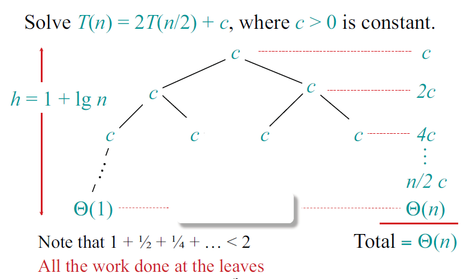

# Lecture 3: Insertion Sort, Merge Sort

## Why sorting?
- Problems become easy once items are sorted.
  - Finding a median:
  - Binary search
  - Data compression(Similar with document distance)
  - Computer graphics

## Insertion Sort
- Given array `A` of size `n`, insert `A[i]` into sorted array `A[0:i-1]` by pairwise swaps down to the correct position.
- `θ(n)` steps(key positions), each step has `θ(n)` compares and swaps. => `θ(n^2)`

> Assumption: **Compares** and **Swaps** are nearly equal in terms of work.

### Binary Insertion sort
- Use binary search to find right position(Because `A[1, ...j - 1]` is already sorted).
- Even binary search will take `θ(log(n))` time, shifting the elements after insertion will still take `θ(n)` time. => Complexity still `θ(n^2)`.

## Merge Sort(Divide and Conquer)
Split an array `A` into two array `L` and `R` and merge sorted `L'` and `R'`.
1) Base case: `if n = 1`, done.
2) Otherwise, recursively sort `A[1, ..., n / 2]` and `A[n/2 + 1, ..., n]`.
3) ***Merge*** the two sorted sub-arrays.

### Merge routine
*Two Finger Algorithm*

### Analyzing merge sort
`T(n) = 2 * T(n/2) + θ(n)`  
`T(n) = 2 * T(n/2) + c * n`

### Space complexity
- Merge sort: `θ(n)` auxiliary space
- In-place sort: `θ(1)` auxiliary space(Insertion sort).